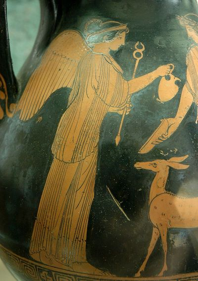

# Iris

In Greek mythology, Iris(Ἶρις) is the personification of the rainbow and messenger of the gods. She was the handmaiden to Hera.
 
# Blog post

See
the [post that presents Iris](https://blog.doit-intl.com/iris-3-automatic-labeling-for-cost-control-7451b480ee13?source=friends_link&sk=b934039e5dc35c9d5e377b6a15fb6381).

# What Iris does for you

Iris automatically assigns labels to Google Cloud Platform resources for easier analysis, particularly of cost.

Resources of all supported types in all or some of the projects in the GCP organization will get automatically-generated labels with keys like `iris_zone` (the prefix is configurable), and a value copied from the resource. For example, a Google Compute Engine instance would get labels like
`[iris_name:nginx]`, `[iris_region:us-central1]` and `[iris_zone:us-central1-a]`. This behavior can be configured in various ways; see below.

## Note: Organization focus

Note that Iris is designed to serve the organization. 
* It is designed to label all projects in the organization (though you can configure that).
* The organization focus was chosen because labels are used for billing analysis which is typically done on the organization level (even though projects can in fact be associated arbitrarily with billing accounts). 

## Iris doesn't add new information

Iris does not *add* information, only *copy* values that already exist. For example, it can label a VM instance with its zone; but it cannot add a "business unit" label because it does not know a resource's business unit. For that, you should label all resources when creating them, e.g., in your Terraform scripts. (Indeed, iris can be made extraneous in this way.)

## Labeling existing resources when you deploy Iris

If you want to label the resources -- virtual machines, PubSub topics etc. -- that *already exist* when you deploy Iris, see section "[Labeling existing resources](#labeling-existing-resources)" below.

# Open source

Iris is open-source;it is not an official DoiT product. Feel free to send Pull Requests with  new functionality and add new types of labels. See the `TODO.md` file and Github
issues for features and fixes you might do.

# When Iris adds labels

## On resource creation

Iris labels newly-created resources by listening to Google Cloud Operations   Logs. You can disable this: See [INSTALL](INSTALL.md) or run `deploy.sh -h`.

## On schedule

Iris labels resources periodically on a Cloud Scheduler "cron" job. By default, only some types of resources are labeled on  these Cloud Scheduler runs, while most types are not labeled on schedule,  , to save the costs of relabeling with the same label every day.

You can change that in configuration. Set `label_all_on_cron` to `True` in the configuration file.

You can also  disable the scheduled labeling. See Deployment below or run `./deploy.sh -h`

## Labeling existing resources

* When you first use Iris, you may want to label all existing resources. Iris does not do this by default.
* Publish a PubSub message (the content doesn't matter) to `iris_label_all_types_topic`, for example with `gcloud pubsub topics publish iris_label_all_types_topic --message=does_not_matter --project $PROJECT_ID` and a full labeling will be triggered.

# Supported Google Cloud resources

Right now, there are plugins for the following types of resources.

To learn from the code what resources and keys are added, search for functions whose
names start `_gcp_`. The part of the function name after `_gcp_` is used for the label key.

* Compute Engine Instances (Labels name, zone, region, instance type)
    * Including preemptible instances and instances created by Managed Instance Groups.
    * Including instances used as GKE Nodes
* Compute Engine Disks (Labels name, zone, region)
    * Disks are labeld on creation and on schedule.
    * But disks created along with an Instance are not labeled on creation. They are labeled with the Cloud Scheduler cron job.
    * The label indicating whether a disk is attached will change, if the state changed, on the scheduled labeling.
* Compute Engine Snapshots (Labels name, zone, region)
* BigQuery Datasets (Labels name, zone, region)
* BigQuery Tables (Labels name, zone, region)
* PubSub Subscriptions (Labels name)
* PubSub Topics (Labels name, zone)
* CloudSQL (Labels name, zone, region)
    * These receive a label only with Cloud Scheduler, not on creation.
* Cloud Storage buckets (Labels name, location)
* In addition to these, any labels on a project may be copied into the resourcs that are in the project, if you have enabled this in  the
  configuration file.

 
# Installing
Please see [INSTALL](./INSTALL.md).
# Architecture
Please see [README_architecture](./README_architecture.md).

# Development and Testing
Please see [HACKING](./HACKING.md).
 